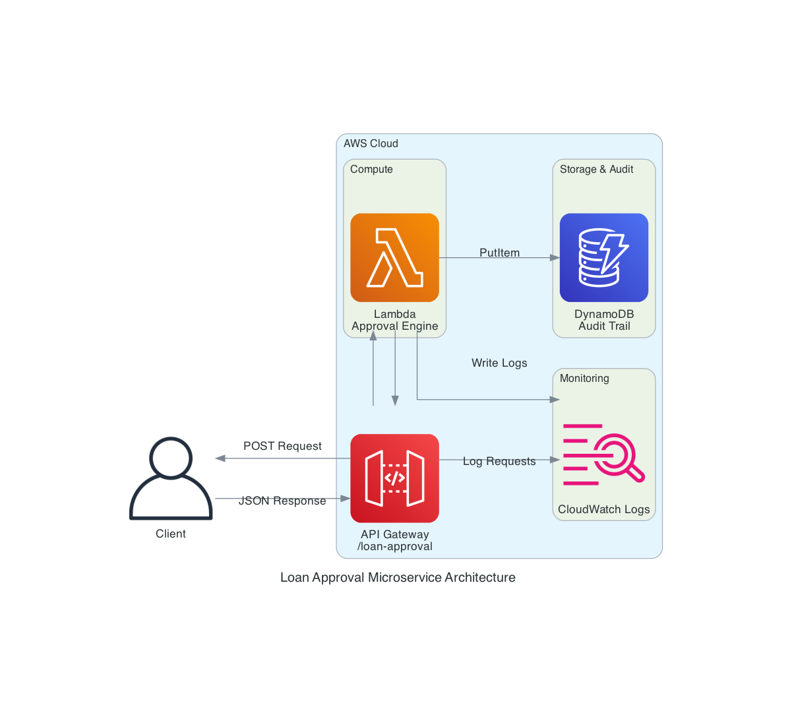

# Design Document

## Overview

The Loan Approval Microservice is a serverless financial services demonstration application built on AWS using infrastructure-as-code principles. The system processes loan applications through a REST API, evaluates them using a transparent credit scoring algorithm, and maintains a complete audit trail for compliance. The architecture emphasizes security, observability, and policy-as-code validation using AWS CloudFormation Guard.

This design is optimized for lightning talk demonstrations, providing a simple yet realistic example of AI-accelerated development in regulated industries. The system showcases modern cloud-native patterns including serverless compute, managed databases, API-first design, and automated compliance validation.

## Architecture

### High-Level Architecture




The architecture follows a serverless, event-driven pattern with the following flow:
- Client sends HTTP POST request to API Gateway
- API Gateway validates the request and invokes Lambda function
- Lambda executes the credit scoring algorithm
- Lambda writes audit records to DynamoDB
- Both API Gateway and Lambda log to CloudWatch
- Response flows back through API Gateway to client

### Component Responsibilities

**API Gateway (REST API)**
- Receives HTTP POST requests at `/loan-approval` endpoint
- Validates request schema and data types before Lambda invocation
- Enforces CORS policies for browser-based testing
- Logs all API requests to CloudWatch
- Provides regional endpoint for low-latency access

**Lambda Function (Approval Engine)**
- Parses incoming loan application data
- Executes credit scoring algorithm with weighted factors
- Generates unique loan identifiers
- Produces approval decisions with reasoning
- Logs decisions to DynamoDB audit trail
- Handles errors gracefully with appropriate HTTP responses

**DynamoDB Table (Audit Store)**
- Stores immutable audit records of all loan decisions
- Uses composite key (loan_id + timestamp) for unique identification
- Implements TTL for automatic 365-day retention
- Provides encryption at rest and point-in-time recovery
- Supports compliance and regulatory audit requirements

**CloudFormation Guard**
- Validates infrastructure templates against financial compliance rules
- Enforces encryption, logging, and IAM best practices
- Runs as pre-deployment gate in CI/CD pipeline
- Generates compliance reports for audit purposes

## Components and Interfaces

### API Gateway Configuration

**Resource Structure:**
- Base API: `LoanApprovalApi`
- Resource path: `/loan-approval`
- Method: `POST`
- Stage: `prod`

**Request Schema:**
```json
{
  "type": "object",
  "properties": {
    "income": {
      "type": "number",
      "minimum": 0,
      "description": "Annual income in dollars"
    },
    "credit_score": {
      "type": "integer",
      "minimum": 300,
      "maximum": 850,
      "description": "FICO credit score"
    },
    "debt_to_income": {
      "type": "number",
      "minimum": 0,
      "maximum": 1,
      "description": "Ratio of debt to income"
    },
    "employment_years": {
      "type": "integer",
      "minimum": 0,
      "description": "Years of employment"
    }
  },
  "required": ["income", "credit_score", "debt_to_income", "employment_years"]
}
```

**Response Schema:**
```json
{
  "loan_id": "string (LN-YYYYMMDD-{uuid})",
  "approved": "boolean",
  "score": "integer (0-100)",
  "reasoning": "string",
  "timestamp": "string (ISO 8601)"
}
```

**CORS Configuration:**
- Allowed origins: `*` (for demo purposes)
- Allowed methods: `POST`, `OPTIONS`
- Allowed headers: `Content-Type`, `X-Amz-Date`, `Authorization`, `X-Api-Key`

**Logging Configuration:**
- Logging level: `INFO`
- Data trace enabled: `true`
- Metrics enabled: `true`
- CloudWatch role: Auto-created

### Lambda Function Design

**Runtime Configuration:**
- Runtime: Python 3.9
- Handler: `loan_approval.lambda_handler`
- Timeout: 30 seconds
- Memory: 256 MB
- Environment encryption: AWS managed key

**Environment Variables:**
- `AUDIT_TABLE_NAME`: DynamoDB table name for audit logging

**IAM Permissions:**
- `dynamodb:PutItem` on audit table (least privilege)
- CloudWatch Logs write permissions (auto-granted)

**Function Structure:**
```python
lambda_handler(event, context)
  ├─ Parse request body
  ├─ Extract applicant data
  ├─ calculate_credit_score()
  ├─ Generate loan ID
  ├─ get_reasoning()
  ├─ log_decision()
  └─ Return response

calculate_credit_score(income, credit_score, debt_to_income, employment_years)
  ├─ Credit score evaluation (40% weight)
  ├─ Income evaluation (25% weight)
  ├─ Debt-to-income evaluation (25% weight)
  ├─ Employment stability evaluation (10% weight)
  └─ Return total score (0-100)

get_reasoning(score, approved)
  └─ Return human-readable explanation

log_decision(loan_id, request_data, response_data)
  ├─ Get table name from environment
  ├─ Write to DynamoDB
  └─ Handle failures gracefully
```

### DynamoDB Table Design

**Table Configuration:**
- Table name: `loan-approval-audit`
- Partition key: `loan_id` (STRING)
- Sort key: `timestamp` (STRING)
- Billing mode: On-demand (PAY_PER_REQUEST)
- Encryption: AWS managed
- Point-in-time recovery: Enabled
- TTL attribute: `ttl` (365 days)

**Item Structure:**
```json
{
  "loan_id": "LN-20241114-abc12345",
  "timestamp": "2024-11-14T18:30:45.123Z",
  "request_data": {
    "income": 75000,
    "credit_score": 720,
    "debt_to_income": 0.3,
    "employment_years": 3
  },
  "response_data": {
    "loan_id": "LN-20241114-abc12345",
    "approved": true,
    "score": 85,
    "reasoning": "Strong credit score and stable financial position",
    "timestamp": "2024-11-14T18:30:45.123Z"
  },
  "ttl": 1731609045
}
```

**Access Patterns:**
- Write: Lambda function writes each decision (PutItem)
- Read: Manual audit queries by loan_id or time range (Query)
- Retention: Automatic deletion after 365 days via TTL

## Data Models

### Loan Application Request

```typescript
interface LoanApplicationRequest {
  income: number;              // Annual income in dollars (>= 0)
  credit_score: number;        // FICO score (300-850)
  debt_to_income: number;      // Ratio (0.0-1.0)
  employment_years: number;    // Years employed (>= 0)
}
```

### Loan Decision Response

```typescript
interface LoanDecisionResponse {
  loan_id: string;             // Format: "LN-YYYYMMDD-{uuid}"
  approved: boolean;           // True if score >= 70
  score: number;               // Calculated score (0-100)
  reasoning: string;           // Human-readable explanation
  timestamp: string;           // ISO 8601 format
}
```

### Audit Record

```typescript
interface AuditRecord {
  loan_id: string;             // Partition key
  timestamp: string;           // Sort key (ISO 8601)
  request_data: LoanApplicationRequest;
  response_data: LoanDecisionResponse;
  ttl: number;                 // Unix timestamp for expiration
}
```

### Credit Scoring Model

The credit scoring algorithm uses a weighted point system:

**Credit Score Factor (40 points max):**
- 750+: 40 points (Excellent)
- 700-749: 30 points (Very Good)
- 650-699: 20 points (Good)
- 600-649: 10 points (Fair)
- <600: 0 points (Poor)

**Income Factor (25 points max):**
- $100,000+: 25 points
- $75,000-$99,999: 20 points
- $50,000-$74,999: 15 points
- $30,000-$49,999: 10 points
- <$30,000: 0 points

**Debt-to-Income Factor (25 points max):**
- ≤20%: 25 points (Excellent)
- 21-30%: 20 points (Good)
- 31-40%: 10 points (Fair)
- 41-50%: 5 points (Marginal)
- >50%: 0 points (High risk)

**Employment Stability Factor (10 points max):**
- 5+ years: 10 points
- 2-4 years: 7 points
- 1 year: 5 points
- <1 year: 0 points

**Decision Logic:**
- Total score = Sum of all factors (capped at 100)
- Approved: score >= 70
- Denied: score < 70

## Error Handling

### API Gateway Level

**Validation Errors (400 Bad Request):**
- Missing required fields
- Invalid data types
- Values outside allowed ranges
- Malformed JSON

Response format:
```json
{
  "message": "Invalid request body"
}
```

### Lambda Function Level

**Processing Errors (400 Bad Request):**
- JSON parsing failures
- Unexpected data formats
- Calculation errors

Response format:
```json
{
  "error": "Error message description"
}
```

**Audit Logging Failures:**
- Non-blocking: Function continues and returns decision
- Logged to CloudWatch for monitoring
- Does not affect client response

### DynamoDB Level

**Write Failures:**
- Handled gracefully in `log_decision()` function
- Error logged to CloudWatch
- Client receives successful loan decision
- Monitoring alerts can be configured for audit failures

### CFN Guard Validation

**Compliance Failures:**
- Blocks deployment before resources are created
- Generates detailed compliance report
- Returns non-zero exit code
- Lists all rule violations with context

## Testing Strategy

### Unit Testing Approach

**Credit Scoring Algorithm Tests:**
- Test each factor independently
- Verify weighted calculations
- Test boundary conditions (min/max scores)
- Validate score capping at 100

**Decision Logic Tests:**
- Test approval threshold (score >= 70)
- Test denial threshold (score < 70)
- Verify reasoning generation for different score ranges

**Error Handling Tests:**
- Test malformed JSON handling
- Test missing field handling
- Test invalid data type handling

### Integration Testing Approach

**API Gateway Integration:**
- Test request validation with valid data
- Test request validation with invalid data
- Verify CORS headers in responses
- Test Lambda integration mapping

**DynamoDB Integration:**
- Verify audit records are written correctly
- Test TTL configuration
- Verify encryption at rest
- Test graceful failure when table unavailable

### End-to-End Testing Scenarios

**Test Scenario 1: High-Quality Applicant**
- Input: income=$100k, credit=780, DTI=0.2, employment=5yrs
- Expected: Approved, score=90-100
- Reasoning: "Excellent credit profile..."

**Test Scenario 2: Marginal Applicant**
- Input: income=$50k, credit=680, DTI=0.4, employment=2yrs
- Expected: Approved, score=70-74
- Reasoning: "Meets minimum requirements..."

**Test Scenario 3: Poor Credit Applicant**
- Input: income=$30k, credit=580, DTI=0.6, employment=0yrs
- Expected: Denied, score<50
- Reasoning: "High risk due to low credit score..."

**Test Scenario 4: Invalid Request**
- Input: Malformed JSON or missing fields
- Expected: 400 error with validation message

### Compliance Testing

**CFN Guard Validation:**
- Run before every deployment
- Validate all security rules pass
- Generate compliance report
- Test with intentionally non-compliant templates

**Security Validation:**
- Verify Lambda environment encryption
- Verify DynamoDB encryption at rest
- Verify IAM least privilege
- Verify no hardcoded secrets
- Verify logging configuration

### Demo Testing Scripts

**Automated Test Script (`test-api.sh`):**
- Retrieves API URL from CDK outputs
- Executes all test scenarios
- Displays formatted results
- Validates expected outcomes

**Compliance Validation Script (`validate-compliance.sh`):**
- Checks CFN Guard installation
- Synthesizes CloudFormation template
- Runs compliance validation
- Generates compliance report
- Displays summary of results

## Deployment Architecture

### Infrastructure as Code

**CDK Stack Structure:**
```
LoanApprovalStack
├── DynamoDB Table (Audit Store)
├── Lambda Function (Approval Engine)
│   ├── IAM Role (auto-created)
│   └── CloudWatch Log Group (auto-created)
├── API Gateway REST API
│   ├── Resource (/loan-approval)
│   ├── Method (POST)
│   ├── Request Validator
│   ├── Request Model
│   └── CORS Configuration
└── Stack Outputs
    ├── API URL
    ├── API Endpoint
    └── Audit Table Name
```

### Deployment Pipeline

```
1. Install Dependencies (npm install)
   ↓
2. Build TypeScript (npm run build)
   ↓
3. Synthesize CloudFormation (cdk synth)
   ↓
4. Validate Compliance (cfn-guard validate)
   ↓
5. Bootstrap CDK (if needed)
   ↓
6. Deploy Stack (cdk deploy)
   ↓
7. Output Endpoints
```

### Configuration Management

**Environment Variables:**
- `CDK_DEFAULT_ACCOUNT`: AWS account ID (from AWS CLI config)
- `CDK_DEFAULT_REGION`: AWS region (from AWS CLI config)
- `AUDIT_TABLE_NAME`: Passed to Lambda via CDK

**CDK Configuration:**
- App entry point: `bin/loan-approval.ts`
- Stack definition: `lib/loan-approval-stack.ts`
- Lambda code: `lambda/` directory
- Compliance rules: `cfn-guard/financial-compliance.guard`

## Security Considerations

### Encryption

**Data at Rest:**
- DynamoDB: AWS managed encryption (AES-256)
- Lambda environment variables: AWS managed KMS key
- CloudWatch Logs: Default encryption

**Data in Transit:**
- API Gateway: HTTPS only (enforced by AWS)
- Lambda to DynamoDB: TLS 1.2+ (AWS SDK default)

### IAM and Access Control

**Lambda Execution Role:**
- Principle of least privilege
- Only `dynamodb:PutItem` on specific audit table
- CloudWatch Logs write permissions
- No wildcard permissions

**API Gateway:**
- No authentication (demo purposes)
- CORS configured for browser access
- Request validation prevents injection attacks

### Audit and Compliance

**Audit Trail:**
- All decisions logged to DynamoDB
- Immutable records (no update/delete operations)
- 365-day retention for compliance
- Queryable by loan ID or time range

**Compliance Validation:**
- Pre-deployment CFN Guard checks
- Enforces encryption requirements
- Validates logging configuration
- Prevents hardcoded secrets
- Ensures IAM best practices

### Monitoring and Observability

**CloudWatch Logs:**
- API Gateway: All requests logged at INFO level
- Lambda: All executions logged
- Retention: 7 days (configurable)

**CloudWatch Metrics:**
- API Gateway: Request count, latency, errors
- Lambda: Invocations, duration, errors, throttles
- DynamoDB: Read/write capacity, throttles

**Alerting Opportunities:**
- High error rates
- Audit logging failures
- Lambda timeout/memory issues
- API Gateway throttling

## Demo Optimization

### Lightning Talk Flow

**5-Minute Demo Structure:**

1. **Introduction (30 seconds)**
   - Show architecture diagram
   - Explain use case

2. **Code Walkthrough (2 minutes)**
   - Show Python Lambda function
   - Explain credit scoring algorithm
   - Highlight simplicity

3. **Compliance Validation (1 minute)**
   - Show CFN Guard rules
   - Run validation script
   - Display compliance report

4. **Live Deployment (1 minute)**
   - Run deployment script
   - Show real-time CDK output
   - Display endpoint URLs

5. **Live Testing (30 seconds)**
   - Execute test script
   - Show approval and denial cases
   - Display audit trail

### Pre-Demo Checklist

- [ ] AWS credentials configured
- [ ] CFN Guard installed
- [ ] Dependencies installed (`npm install`)
- [ ] Test data reviewed
- [ ] Scripts tested in target environment
- [ ] Cleanup previous deployments
- [ ] Terminal font size increased for visibility

### Demo Recovery Strategies

**If deployment fails:**
- Show pre-deployed backup environment
- Walk through CloudFormation events
- Demonstrate compliance validation locally

**If API test fails:**
- Use curl with sample data directly
- Show CloudWatch logs
- Explain error handling

**If compliance validation fails:**
- Show intentional violation
- Demonstrate how CFN Guard catches issues
- Fix and re-validate

## Future Enhancements

While this design is complete for demo purposes, potential enhancements include:

- API authentication (API keys, Cognito, IAM)
- Rate limiting and throttling
- Multi-region deployment
- Enhanced credit scoring models
- Machine learning integration
- Real-time fraud detection
- Customer notification system
- Admin dashboard for audit queries
- Automated testing in CI/CD
- Performance testing and optimization
